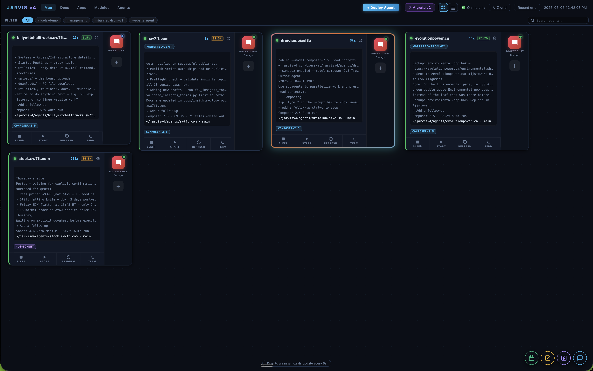
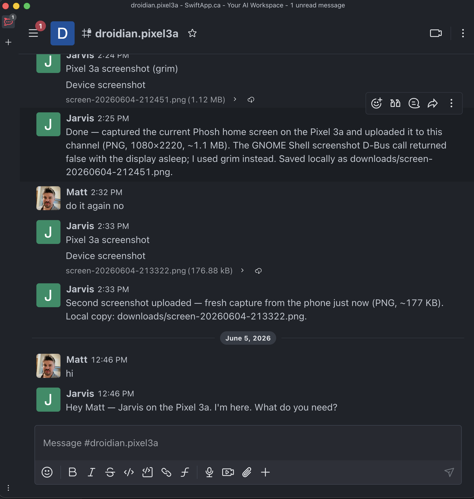

# JARVIS v4

**Multi-agent AI operations on your MacBook** — each client gets a Rocket.Chat
channel, a persistent tmux session, a Cursor CLI agent, and SSH access to their
server. Operators chat in Rocket.Chat; agents work locally (and over SSH) and
reply in the same room.

> **Keywords:** Rocket.Chat · tmux · Cursor agent · SSH · multi-tenant ops · self-hosted · MacBook control plane

<p align="center">
  
</p>
<p align="center"><sub><strong>JARVIS v4 dashboard</strong> (<code>python3 app.py</code> → <code>:5112</code>) — draggable agent cards, live pane preview, Rocket.Chat health, deploy, and in-browser tmux terminal.</sub></p>

---

## Documentation

| Start here | Description |
|------------|-------------|
| **[📖 Full documentation index](docs/README.md)** | Every guide, searchable by topic |
| **[🚀 Deployment guide](docs/deployment-guide.md)** | Clone → RC → SSH → deploy → test |
| **[💬 Rocket.Chat integration](docs/rocketchat-integration.md)** | Channels, monitor, webhooks, security |
| **[💻 MacBook + tmux setup](docs/macbook-tmux-setup.md)** | Sessions, attach/detach, multi-agent |
| **[🧩 Agent apps](docs/apps-system.md)** | RC, mail, browser — install & injection |
| **[📦 Modules](docs/modules-system.md)** | Contact forms & remote deploy packages |

**Security:** [SECURITY.md](SECURITY.md) · run `./scripts/audit-secrets.sh` before pushing

---

## The full stack

JARVIS v4 is three layers: **chat interface**, **control plane** (your laptop),
and **client servers** (remote SSH targets). Nothing runs in the cloud except
your Rocket.Chat server (which you can self-host).

```
┌─────────────────────────────────────────────────────────────────────────────┐
│  OPERATORS & CLIENTS                                                        │
│  Rocket.Chat mobile / desktop / web  ·  Website contact forms (optional)    │
└───────────────────────────────┬─────────────────────────────────────────────┘
                                │
                                ▼
┌─────────────────────────────────────────────────────────────────────────────┐
│  ROCKET.CHAT SERVER  (self-hosted or cloud)                                 │
│  https://chat.example.com                                                   │
│                                                                             │
│  Per agent:  private group #example.com                                     │
│              incoming webhook  ← contact forms, external integrations         │
│              message history   ← poll + send via REST API                     │
│                                                                             │
│  Credentials (never in git):  ~/.config/rocketchat/config.json              │
│    · admin account  → deploy.py creates channels + webhooks                   │
│    · bot account    → monitor polls, agent replies post as bot              │
└───────────────────────────────┬─────────────────────────────────────────────┘
                                │  HTTPS outbound (poll every ~10s)
                                ▼
┌─────────────────────────────────────────────────────────────────────────────┐
│  JARVIS HOST  — your MacBook or Linux box                                   │
│                                                                             │
│  deploy.py          scaffold agents, RC ops, launch tmux                    │
│  app.py :5112       web dashboard — fleet map, deploy, terminal, apps       │
│                                                                             │
│  agents/example.com/                                                        │
│    context.md       agent instructions (identity, SSH host, RC channel)     │
│    apps/            per-agent CLI tools (RC, mail, browser)                 │
│    logs/            dispatch.log audit trail                                │
│                                                                             │
│  tmux session "example-com"  (one session per agent)                        │
│  ┌──────────────────────────────┐  ┌────────────────────────────────────┐ │
│  │ Pane 1: Cursor CLI agent     │  │ Pane 2: rocketchat.py monitor      │ │
│  │  · reads context.md          │◄─┤  · polls #example.com              │ │
│  │  · runs tools, SSH, apps     │  │  · dispatches messages → pane 1    │ │
│  │  · sandboxed filesystem      │  │  · STOP → Ctrl-C pane 1            │ │
│  │  · replies via RC send       │  │  · shell for background jobs       │ │
│  └──────────────────────────────┘  └────────────────────────────────────┘ │
│                                                                             │
│  SSH key  →  ~/.ssh/config  →  ssh example.com                              │
└───────────────────────────────┬─────────────────────────────────────────────┘
                                │  SSH (key-based, outbound)
                                ▼
┌─────────────────────────────────────────────────────────────────────────────┐
│  CLIENT SERVER  (remote — one per agent)                                    │
│  ssh example.com                                                            │
│                                                                             │
│  Typical work: websites, PHP, nginx, git repos, cron, logs, databases       │
│  Modules ship here:  contact-submit.php → RC webhook                        │
│  Agent runs git/deploy on the server — not in agents/example.com/ locally   │
└─────────────────────────────────────────────────────────────────────────────┘
```

**Deep dive:** [docs/architecture.md](docs/architecture.md)

---

## Components

| Component | Where it runs | Role |
|-----------|---------------|------|
| **Rocket.Chat** | Your RC server (VPS/cloud) | Primary UI — operators and clients message agents in private channels |
| **RC monitor** | JARVIS host, tmux pane 2 | Polls channel, forwards human messages to Cursor, handles STOP |
| **Cursor CLI agent** | JARVIS host, tmux pane 1 | The AI worker — tools, reasoning, SSH, apps |
| **tmux** | JARVIS host | Process supervisor — sessions survive terminal close |
| **deploy.py** | JARVIS host | Creates agent dirs, RC channel/webhook, injects apps, launches tmux |
| **app.py dashboard** | JARVIS host `:5112` | Fleet map, deploy modal, live terminal, app install |
| **SSH + key** | JARVIS host → client server | Agent connects to client infrastructure to do real work |
| **Apps** (`rocketchat`, `mailinbox`, `browser`) | JARVIS host, per agent | CLI tools copied into `agents/<name>/apps/` |
| **Modules** (`contact-form`, …) | Client server | PHP/scripts deployed via SSH; post into RC via webhook |
| **dispatch.log** | JARVIS host, per agent | JSON audit trail — every inbound dispatch and outbound send |

---

## Rocket.Chat — how it works

Rocket.Chat is **the product interface**, not just notifications — one private channel per agent, on mobile, desktop, or web.

<p align="center">
  
</p>
<p align="center"><sub>Each agent has its own channel (e.g. <code>#droidian.pixel3a</code>). You chat; the agent replies in the same room.</sub></p>

| What | How |
|------|-----|
| **One channel per agent** | `#example.com` private group, created by `deploy.py` |
| **Inbound (human → agent)** | Pane 2 polls RC REST API every N seconds (default 10) |
| **Outbound (agent → human)** | `python3 apps/rocketchat.py send "#example.com" "reply"` |
| **Webhooks (site → RC)** | Incoming webhook URL injected at deploy; contact forms POST here |
| **Credentials** | `python3 apps/master-rocketchat.py setup` → `~/.config/rocketchat/config.json` |
| **Audit** | `agents/<name>/logs/dispatch.log` — `dispatch`, `send`, `stop` events |
| **Emergency stop** | Post `STOP`, `HALT`, or `ABORT` alone in the channel |

```
You post in #example.com
       ↓  (~10s poll)
rocketchat.py monitor (pane 2)
       ↓  tmux send-keys
Cursor agent (pane 1) — reads message, SSHs, runs tools
       ↓
python3 apps/rocketchat.py send "#example.com" "Done."
       ↓
Message appears in #example.com
```

**Full guide:** [docs/rocketchat-integration.md](docs/rocketchat-integration.md)

---

## SSH & client servers — how it works

Each agent is tied to a **remote server** via SSH. The agent name usually matches
the SSH host alias (e.g. agent `example.com` → `ssh example.com`).

### SSH key setup (one-time, on JARVIS host)

1. Generate or use an existing key: `~/.ssh/id_ed25519`
2. Add the public key to the client server's `~/.ssh/authorized_keys`
3. Configure `~/.ssh/config`:

```
Host example.com
    HostName 203.0.113.10
    User deploy
    IdentityFile ~/.ssh/id_ed25519
    IdentitiesOnly yes
```

4. Verify: `ssh example.com hostname && whoami`

SSH keys and server IPs **never go in this repo** — they live in `~/.ssh/` on
your JARVIS machine. Each agent's `context.md` records which host to use.

### What agents do on the server

| Task | Where |
|------|-------|
| Website files, nginx, PHP | Remote server via SSH |
| `git pull`, deploy, restart services | Remote server |
| Read server logs, disk, cron | Remote server |
| Rocket.Chat replies | JARVIS host (`apps/rocketchat.py send`) |
| Local agent notes, utilities | `agents/<name>/` on JARVIS host only |

Git for client projects runs **on the server**, not in the local agent directory.
The local `agents/example.com/` folder is the agent's brain and audit trail — not
the client's git repo.

### Modules on the server

Optional packages in `modules/` (e.g. `contact-form`) are deployed to the
client web root via `scp`/`ssh`. They POST form submissions to the agent's RC
incoming webhook — the monitor picks them up like any other message.

**Full guide:** [docs/modules-system.md](docs/modules-system.md)

---

## The 1:1:1:1 mapping

One name ties everything together:

| Resource | Example for agent `example.com` |
|----------|----------------------------------|
| Agent directory | `agents/example.com/` |
| Rocket.Chat channel | `#example.com` |
| tmux session | `example-com` (dots → dashes) |
| SSH host alias | `example.com` in `~/.ssh/config` |

---

## Optional apps (per agent)

Installed into `agents/<name>/apps/` — see [docs/apps-system.md](docs/apps-system.md).

| App | Purpose | Install |
|-----|---------|---------|
| **rocketchat.py** | Messaging + monitor | Always (every deploy) |
| **mailinbox.py** | IMAP/SMTP email | Deploy flags or dashboard |
| **browser.py** | Persistent Chrome profile | Dashboard opt-in |

---

## Quick start (Mac, ~5 minutes)

```bash
brew install tmux jq
git clone https://github.com/sw7ft/jarvis-v4.git && cd jarvis-v4

./scripts/check-prerequisites.sh
python3 -m venv .venv && source .venv/bin/activate
pip install -r requirements.txt

# 1. Rocket.Chat credentials (local only, never committed)
python3 apps/master-rocketchat.py setup

# 2. SSH key on server + ~/.ssh/config entry for example.com

# 3. Deploy agent (creates #example.com + tmux session)
python3 deploy.py example.com --no-attach

# 4. Dashboard
python3 app.py    # → http://localhost:5112
```

Post in `#example.com` in Rocket.Chat. The agent should reply within ~10 seconds.

**Step-by-step:** [docs/deployment-guide.md](docs/deployment-guide.md)

---

## Repository layout

| Path | Purpose |
|------|---------|
| [`deploy.py`](deploy.py) | Create/refresh agents, RC channel + webhook, tmux |
| [`app.py`](app.py) | Web dashboard (Flask, port 5112) |
| [`apps/`](apps/) | Master app scripts (copied + injected per agent) |
| [`modules/`](modules/) | Optional remote deploy packages (e.g. contact-form PHP) |
| [`docs/`](docs/) | **All documentation** — start at [docs/README.md](docs/README.md) |
| [`agents/_example/`](agents/_example/) | Reference agent scaffold (no secrets) |
| [`MASTER-CONTEXT.md`](MASTER-CONTEXT.md) | Rules every agent reads at runtime |

---

## Requirements

| Requirement | Notes |
|-------------|-------|
| macOS 12+ or Linux | JARVIS host |
| Python 3.9+, tmux 3+ | Control plane |
| [Cursor CLI](https://cursor.com) | Agent runtime in tmux pane 1 |
| Rocket.Chat server | Self-hosted or cloud — the chat layer |
| SSH key + server access | Per client — agent does work remotely |
| Optional: Chrome | Browser app |
| Optional: IMAP server | Mail app |

---

## Contributing

See [CONTRIBUTING.md](CONTRIBUTING.md). Do not commit credentials, real agent
directories, SSH private keys, or production hostnames. PRs should pass
`./scripts/audit-secrets.sh`.

---

## License

MIT — [LICENSE](LICENSE)
